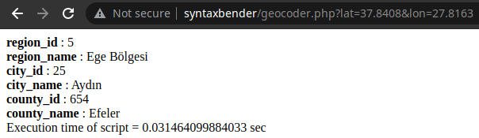

# Reverse Geocoding
- epsg4326 koordinat sisteminde gelen koordinat noktalarına göre türkiye sınırları içerisinde **il ilçe bölge** bilgisi döndürür.
- veriler osm'den alınmış ve işlenmiştir.
- phpmyadmin export dosyası olan sql dosyası import edilmelidir.


## Verileri nasıl oluşturdum?
- OpenStreetMap verilerini kısmı olarak belirli sorgular(Overpass Query) çerçevesinde Overpass API ile alabilmekteyiz.
- Overpass API GUI arayüzü olan https://overpass-turbo.eu/ ile hızlıca istediğimiz sorguları çalıştırıp ihtiyacımız olan verileri alabilmekteyiz.
- Türkiye idari sınırlarını almak için gerekli query;
```
[out:json];
(area["name"="Türkiye"] -> .a;);
(rel(area)["type"="boundary"]["boundary"="administrative"];);
out geom;
```
- Overpass turbo ile osmtogeojson kütüphanesi arkaplanda tarayıcı tabanlı olarak çalışıp geojson formatında aldığımız çıktıyı veritabanına import etmeliyiz.
- Fakat bu işlem öncesinde veritabanı yükünü hafifletmek amacıyla geojson minifier işlevini sağlayan bir kütüphane ile veriyi minify etmek yararlı olabilir. bu işlem için mapshaper kullanabiliriz.
```
mapshaper osm_turkey.geojson -simplify dp 20% keep-shapes -o format=geojson precision=0.001 turkey.geojson

```
- Terminalde benzer parametreler içeren, %80 kayıplı veri, 3 ondalıklı basamağa sahip koordinatlar oluşturmayı ifade eden komut işimizi bir hayli görecektir.(detaylı bilgi için mapshaper dökümanına göz atabilirsiniz.)
- Bu işlem sonrasında geojson verisini veritabanına import etmek kalıyor.
- Import işlemi için şu repoya göz atabilirsiniz. https://github.com/syntaxbender/Overpass-OSM-MySQL
- Reverse geocoding işlemini veritabanı üzerinde saklı yordam vasıtasıyla yapmaktayım. Aşağıdaki saklı yordamı oluşturduğunuz veritabanı yapısına göre düzenleyip kullanabilirsiniz. Eğer ki 1 saniye üzerinde bir sorgu süreniz varsa osm'den aldığınız veri boyutunu ve hassasiyeti, saklı yordamdaki ve veritabanı yapısındaki ilişkileri kontrol etmenizi öneririm.

```
DELIMITER $$
CREATE DEFINER=`root`@`localhost` PROCEDURE `reverseGeocoding` (IN `point` CHAR(255))  BEGIN
	set @loc_point = ST_GeomFromText(point,4326);
	select id, name INTO @region_id, @region_name FROM regions where ST_INTERSECTS(geometry, @loc_point) limit 1;
	select id, name INTO @city_id, @city_name FROM cities where ST_INTERSECTS(geometry, @loc_point) and region_id=@region_id limit 1;
	select id, name INTO @county_id, @county_name from counties where ST_INTERSECTS(geometry, @loc_point) and city_id=@city_id limit 1;
	select
		@region_id as region_id,
		@region_name as region_name,
		@city_id as city_id,
		@city_name as city_name,
		@county_id as county_id,
		@county_name as county_name;
END$$
DELIMITER ;
```

## Dipnot
- OSM'den aldığımız data'da bazı ilçelerin relationları sorunluydu.
- Hatalı ilçelerin ilişkileri export ettiğim sql dosyasında düzeltilmiş durumdadır.
- Ayrıca Türkiye sınırları dışından da bazı veriler mevcuttu onlar da export edilen sql dosyasında temizlenmiş durumdadır.
## Teşekkür
- İzzet Kılıç'a araştırma sürecimi hızlandırmasındaki katkılarından dolayı teşekkür ediyorum. (https://github.com/izzetkalic/geojsons-of-turkey)

## Kaynaklar ve notlar

### pip algosu yazsak?
- https://www.toptal.com/python/computational-geometry-in-python-from-theory-to-implementation
- http://www.plumislandmedia.net/mysql/haversine-mysql-nearest-loc/ (kafa açıcı) (pdf olarak da ekledim)
### MySQL'de pip için çözüm
- https://dev.mysql.com/doc/refman/8.0/en/spatial-types.html
### Diğer Kaynaklar
- https://mysqlserverteam.com/spatial-reference-systems-in-mysql-8-0/
- https://mysqlserverteam.com/upgrading-spatial-indexes-to-mysql-8-0/
- https://dev.mysql.com/doc/refman/8.0/en/creating-spatial-indexes.html
- https://dev.mysql.com/doc/refman/5.7/en/spatial-geojson-functions.html
